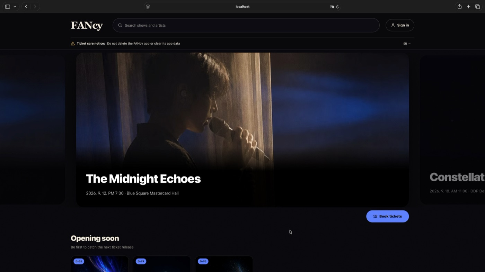
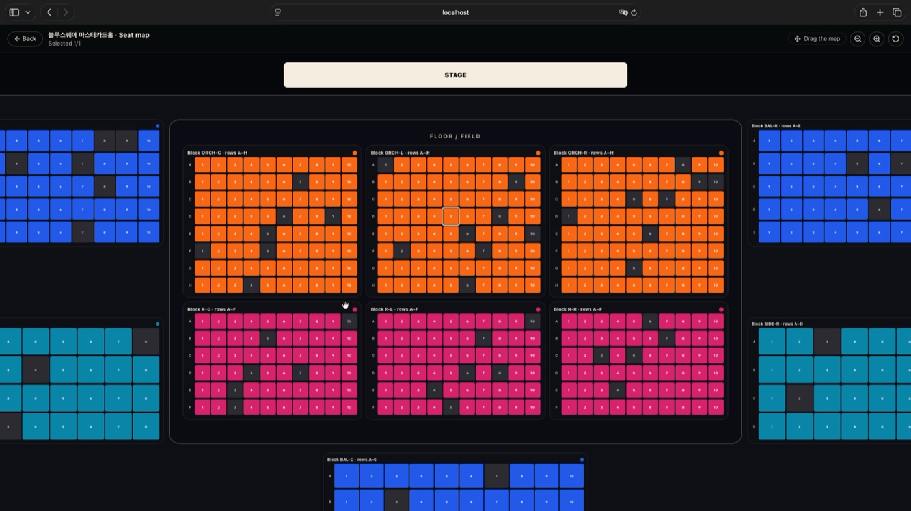
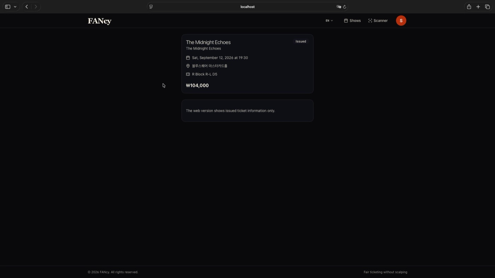
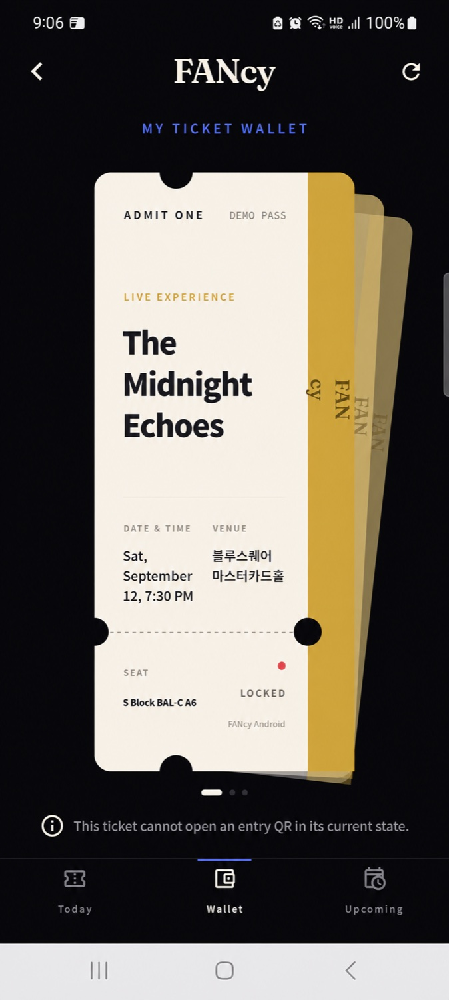
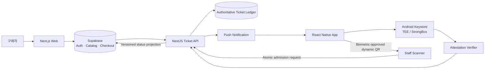

  

<h1 align="center">FANcy</h1>

<strong>티켓을 파일이 아니라 사람·기기·생체 승인에 묶습니다.</strong>

A device-bound ticketing experience designed to resist scalping and copied QR entry.

  
  
  
  

> 이 저장소는 대회 심사를 위한 **제품·기술 공개 자료**입니다. 운영 소스코드, 자격증명, 사용자 데이터는 포함하지 않습니다. 대회 규정상 코드 검토가 필요하면 원본 비공개 저장소를 별도로 제공합니다.

## 30초 소개

기존 모바일 티켓은 캡처된 QR이나 계정 공유만으로 실제 소유자와 입장자를 분리하기 쉽습니다. FANcy는 웹 예매 후 티켓을 수령자의 Google 신원, 한 대의 활성 휴대폰, 하드웨어 보호 키에 연결합니다. 입장 QR은 모바일 생체 승인 후 짧게 발급되며 서버가 최신 상태와 1회 사용 여부를 최종 판정합니다.

핵심은 **이미지 복제를 막는 것**이 아니라, 복제된 이미지가 입장 권한이 되지 못하게 만드는 것입니다.

## 제품 화면

| 공연 탐색 | 좌석 선택 |
|---|---|
|  |  |

| 웹 티켓 상태 | Android 실기기 지갑의 잠금 상태 |
|---|---|
|  |  |

화면에는 테스트 공연 데이터만 사용했습니다. 실기기 지갑 이미지는 폐기된 테스트 티켓 식별자를 `DEMO PASS`로 익명화했습니다.

## 사용자 여정

1. 사용자가 웹에서 Google 로그인 후 공연과 좌석을 선택합니다.
2. 여러 장을 구매할 때 다른 수령자만 Google 이메일을 입력합니다. 빈 좌석은 예매 계정에 묶음으로 배정됩니다.
3. 앱으로 승인 알림이 전달됩니다.
4. 수령자가 같은 Google 신원으로 앱에 로그인하고 생체 인증을 진행합니다.
5. 모바일 하드웨어 키와 원격 검증 결과가 일치해야 티켓이 활성화됩니다.
6. 공연 입장 가능 시간에 생체 승인 후 동적 QR을 발급합니다.
7. 권한이 있는 스태프가 QR을 스캔하면 서버가 한 번만 입장을 승인합니다.

자세한 시연 순서는 [데모 가이드](docs/DEMO.md)에 정리했습니다.

## 시스템 구조

웹은 예매·결제·카탈로그를 담당하고, 앱 API 원장이 티켓 소유권·기기·키·QR·입장 상태를 최종 판정합니다. 두 시스템은 멱등 주문 처리와 버전이 있는 상태 이벤트로 연결됩니다. 자세한 내용은 [아키텍처](docs/ARCHITECTURE.md)를 참고하세요.

## 기술적 차별점

- **기기 귀속:** 개인키는 지원 기기의 Android Keystore TEE/StrongBox 안에서 생성되고 외부로 내보내지 않습니다.
- **생체 승인:** 서버 challenge 서명 시 OS 생체 인증을 요구하며 생체 원본은 앱이나 서버가 저장하지 않습니다.
- **상태 기반 QR:** QR 이미지 자체가 권리가 아니라 서버 원장의 활성 상태·현재 nonce·입장 시간·사용 여부가 권리입니다.
- **원자적 1회 입장:** 같은 QR을 동시에 스캔해도 한 요청만 입장 상태를 획득하도록 설계했습니다.
- **권한 분리:** 관리자·관계자·현장 스태프를 분리하고 관리자는 필요한 권한을 상속합니다.
- **실패 시 잠금:** 기기 키가 무효화되거나 검증할 수 없으면 티켓과 QR 발급이 실패 닫힘으로 전환됩니다.

보호 범위와 OS 제약은 [보안 모델](docs/SECURITY_MODEL.md)에 투명하게 기록했습니다.

## 구현 범위

| 영역 | 구현된 제품 흐름 |
|---|---|
| Web | 공연 탐색, 좌석도, Google 로그인, 수령자 지정, 결제·발급 상태, 내 티켓 |
| Mobile | Google 로그인, 활성 기기, 생체 승인, 티켓 묶음 지갑, 동적 QR, 보안 상태 안내 |
| Backend | 주문 멱등성, 좌석 hold, 기기·키 바인딩, 상태 원장, 푸시, 입장 검증 |
| Operations | 관리자·관계자·스태프 권한, 현장 스캐너, 감사 기록, 결제 복구 경계 |

## 검증 근거

2026-09-10 제출 기준 브랜치에서 다음을 확인했습니다.

- 앱/API/검증 서비스: **444개 테스트 통과**, 타입 검사·린트 통과
- 웹: **551개 테스트 통과**, 타입 검사·린트 통과
- 합계: **995개 자동 테스트 통과**
- Android 실기기: Google 로그인, 하드웨어 키 등록, 생체 승인, 티켓 잠금 동작 확인
- 비밀값 검사: 공개 대상 파일에서 환경 비밀값·개인키·토큰 미검출

해당 실행에서 로컬 Supabase가 필요한 웹 DB 통합 테스트 63개는 실행 조건이 없어 제외했습니다. 자동 검증을 운영 환경 검증으로 과장하지 않으며, 세부 명령과 한계는 [검증 보고서](docs/VALIDATION.md)에 적었습니다.

## 데모

- [2분 웹 제품 워크스루 다운로드](https://github.com/blockcoder-sj/fancy-showcase/releases/download/v1.0-showcase/fancy-web-showcase.mp4)
- [심사위원용 3분 시연 순서](docs/DEMO.md)

영상은 공개 전 구간을 검토하고 개인정보가 등장하기 전 구간만 새 파일로 내보냈습니다.

## 공개 범위

이 저장소에는 설명 문서와 익명화된 시각 자료만 있습니다. 다음 항목은 의도적으로 공개하지 않습니다.

- 앱·웹·서버 원본 소스와 전체 Git 이력
- `.env`, OAuth·결제·DB·푸시·QR·연동 비밀값
- 모바일 서명키, attestation 개인키, Firebase 설정 파일
- 사용자·주문·결제·티켓·입장 데이터
- 보안 우회를 재현할 수 있는 내부 운영 수치와 공격 절차

문서와 미디어는 심사·소개 목적으로만 공개되며 무단 사용을 허용하지 않습니다. 보안 제보는 [SECURITY.md](SECURITY.md)를 이용해 주세요.

## 프로젝트 상태

FANcy는 대회 시연이 가능한 통합 프로토타입입니다. 이 저장소의 자료는 프로덕션 배포 완료나 외부 보안 인증을 의미하지 않습니다. 실제 서비스 출시 전에는 결제 사업자·Google OAuth·HTTPS 환경의 독립 E2E, 운영 모니터링, 법무·개인정보 검토가 추가로 필요합니다.
