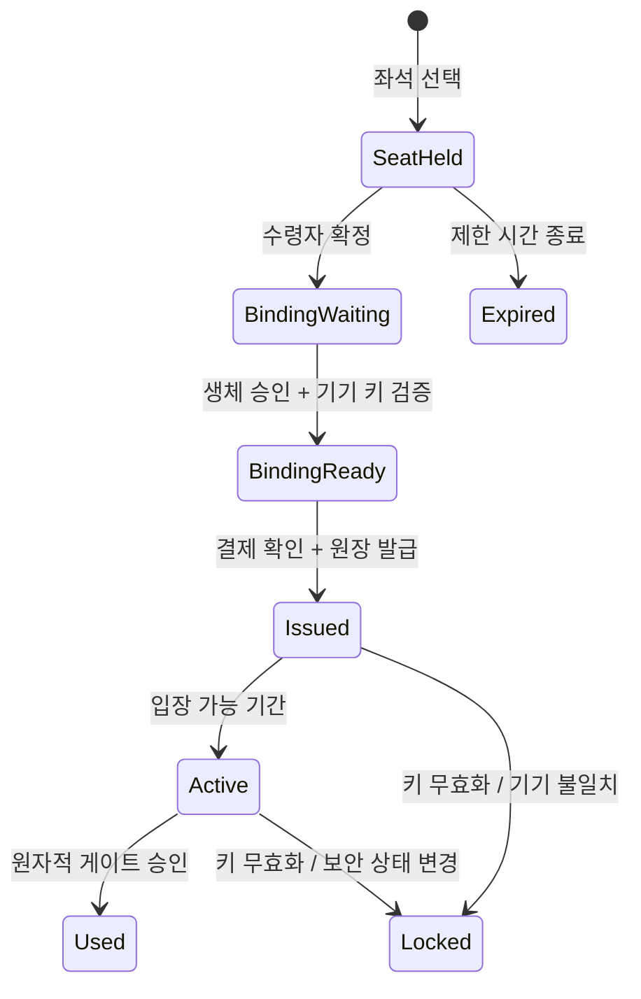

# FANcy 아키텍처

## 설계 목표

FANcy는 브라우저에서 결제한 티켓을 모바일 기기의 하드웨어 보호 키에 연결하고, 서버가 입장 순간까지 소유권과 사용 상태를 판정하는 구조입니다. 웹 화면이나 QR 이미지 한 장이 독립적인 입장권이 되지 않도록 신뢰 경계를 분리했습니다.

## 구성 요소

| 구성 요소 | 책임 | 신뢰하지 않는 입력 |
|---|---|---|
| Next.js Web | 공연 탐색, 좌석 선택, 수령자 지정, 결제 흐름, 운영 화면 | 브라우저의 사용자 입력과 결제 재시도 |
| Supabase | Google 인증 세션, 웹 카탈로그·주문·권한 데이터 | 클라이언트가 주장하는 관리자·소유자 권한 |
| Ticket API | 티켓 소유권, 기기·키 바인딩, QR, 입장 상태의 최종 판정 | 웹 상태만으로 주장하는 티켓 발급 완료 |
| Ticket Ledger | 주문·좌석·티켓·기기·키·입장의 권위 있는 상태 | 외부 시스템의 비버전 상태 변경 |
| Mobile App | 활성 기기 등록, 생체 승인, 지갑, 동적 QR | 로컬 UI만으로 주장하는 인증 성공 |
| Attestation Verifier | Android/iOS 하드웨어 키 증명 검증 | 클라이언트가 자체 선언한 보안 수준 |
| Staff Scanner | 행사·게이트 범위 내 QR 전달과 결과 표시 | QR 본문만으로 판단하는 입장 가능 여부 |

## 발급 상태 흐름

## 웹과 앱 원장의 정합성

웹의 결제 상태와 앱의 티켓 상태는 같은 데이터베이스 행을 공유하지 않습니다. 대신 각 주문은 외부 참조로 멱등 처리되고, 앱 티켓 상태는 단조 증가 버전이 있는 이벤트로 웹에 투영됩니다.

이 분리는 다음을 보장하기 위한 것입니다.

- 웹에서 결제가 보인다는 이유만으로 QR을 발급하지 않습니다.
- 중복 callback과 네트워크 재시도가 티켓을 여러 번 만들지 않습니다.
- 늦게 도착한 과거 상태가 최신 잠금·사용 상태를 되돌리지 않습니다.
- 웹이 일시적으로 중단되어도 티켓 API의 입장 원장이 권위를 유지합니다.

## 다중 티켓

같은 예매 계정에 배정된 여러 좌석은 한 번의 모바일 승인으로 동일한 수령자 기기 키에 바인딩할 수 있습니다. 다른 사람에게 줄 좌석만 완전한 Google 로그인 이메일을 입력하고, 비어 있는 좌석은 대표 예매 계정에 배정합니다.

## 현장 입장

스태프 스캐너는 QR을 해석해 자체 승인하지 않습니다. 인증된 스태프·행사·게이트 범위와 함께 티켓 API에 전달하고, 서버가 현재 QR, 입장 시간, 티켓 상태, 기존 사용 여부를 한 트랜잭션 안에서 검사합니다.
